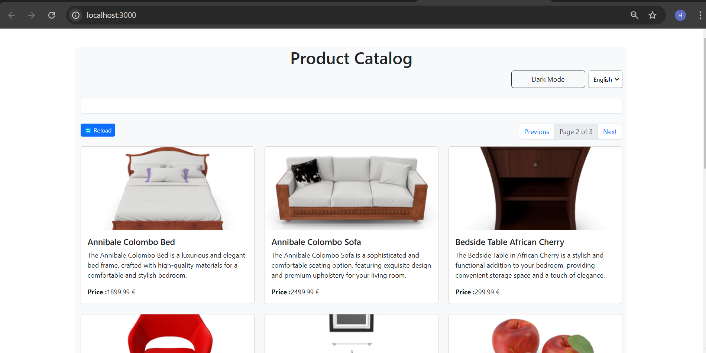
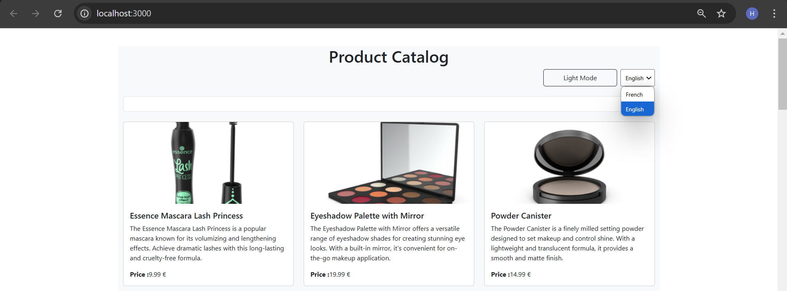

# 📌Application de Gestion de Produits
Cette application a pour objectif de mettre en pratique l'utilisation des Hooks React (useState, useEffect, useContext) ainsi que la création de Hooks personnalisés.



## 🚀 Fonctionnalités
- 🔍 Recherche en temps réel avec filtrage dynamique des produits
- 🌍 Gestion des préférences de langue (Français/Anglais)
- 🔄 Rechargement des produits pour mettre à jour la liste
- 📑 Pagination pour naviguer entre les pages de résultats


## 🛠️ Technologies utilisées
- **React.js** : Une bibliothèque JavaScript pour construire des interfaces utilisateur dynamiques.
- **CSS** : Style moderne et responsive pour une meilleure expérience utilisateur.

## 🎯 Objectifs du projet
- Fournir une base simple pour apprendre et explorer les concepts fondamentaux de React.js, comme les composants, états et props.
- Proposer une interface utilisateur minimaliste et conviviale pour gérer des tâches.


## 🏗️ 1 État et Effets 
### 🎯 Objectif : Implémenter une recherche en temps réel

### 1.1 Modifier le composant ProductSearch pour utiliser la recherche

#### Problématique 
Le problème principal est d'envoyer la valeur searchTerm du composant ProductSearch vers le composant ProductList afin de filtrer les produits en fonction de ce terme.


#### ✅ Solution :
Pour transmettre la valeur searchTerm du composant ProductSearch à ProductList, j'ai déplacé le hook useState au niveau du composant parent (App). Ensuite, j'ai passé la fonction setSearchTerm en prop à ProductSearch. Ainsi, lorsque l'utilisateur saisit du texte dans l'input, App met à jour searchTerm, qui est ensuite transmis à ProductList pour filtrer les produits.

_Réponse pour l'exercice 1 :_

_App.js:_
```js

const App = () => {
  const [searchTerm, setSearchTerm] = useState("");
   //....
  return (
    //....
        <ProductSearch setSearchTerm={setSearchTerm} />
        <ProductList searchTerm={searchTerm} />
    //....
  );
};

```

_ProductList.js:_
```js
const ProductList = ({searchTerm}) => {  
  const { 
    products, 
    loading, 
    error,
  } = useProductSearch();
  
  if(searchTerm!=''){
    var filtredProducts=products.filter(
      (p)=>p.title.toUpperCase().includes(searchTerm.toUpperCase())
      || p.description.toUpperCase().includes(searchTerm.toUpperCase())
      || p.price.toString().toUpperCase().includes(searchTerm.toUpperCase())
    )
  }else{
    filtredProducts=products;
  }
  ....
  return (
    <div>
      <div className="row row-cols-1 row-cols-md-2 row-cols-lg-3 g-4">
        {filtredProducts.map(product => (
          <div key={product.id} className="col">
            <!--...-->
          </div>
        ))}
      </div>
    </div>
  );
};

```
_ProductSearch
.js:_
```js
const ProductSearch = ({setSearchTerm}) => {
  return (
    <div className="mb-4">
      <input
        type="text"
        onChange={(e) => setSearchTerm(e.target.value)}
        //...
      />
    </div>
  );
};

```


### ⏳ 1.2 Implémenter le debounce sur la recherche

Pour implémenter le debounce, nous allons utiliser le hook useDebounce.


_Installation avec npm_
```bash 
npm install use-debounce
```

_Importer useDebounce_
```js
import { useDebounce  } from "use-debounce";
```

#### Utilisation de useDebounce
Nous allons utiliser un useState pour stocker la valeur de l’input et détecter ses changements. Ensuite, nous utilisons useDebounce pour retarder la mise à jour de la valeur, et un useEffect pour exécuter setSearchTerm une fois que le délai est écoulé.

```js
const ProductSearch = ({setSearchTerm}) => {
//...
  const [inputValue, setInputValue] = useState("");
  const [debouncedSearchTerm] = useDebounce(inputValue,1000);

  useEffect(() => {
    setSearchTerm(debouncedSearchTerm);
  }, [debouncedSearchTerm]);

  return (
    <div className="mb-4">
      <input
        type="text"
        input={inputValue}
        onChange={(e) => setInputValue(e.target.value)}
      />
    </div>
  );
};
```


#### Captures d'écran:


## 🌍 2 Context et Internationalisation

### Objectif :
L'objectif est de gérer les préférences de langue dans l'application en permettant aux utilisateurs de changer la langue de l'interface entre Français et Anglais.

 ### 2.1 Création du LanguageContext

Nous avons défini un contexte React directement dans App.js pour gérer la langue sélectionnée. Un useState permet de stocker la langue actuelle, et l'application est enveloppée avec LanguageContext.Provider afin que tous les composants puissent y accéder et s'adapter dynamiquement à la langue choisie.


### 2.2 Ajouter le sélecteur de langue
Nous avons ajouté un sélecteur (select) permettant à l'utilisateur de changer la langue.


_Réponse pour l'exercice 2 :_

_App.js_
```jsx
const [language, setLanguage] = useState("FR"); 
const t = translations[language]; 

 return (
{....}
<LanguageContext.Provider value={{language, setLanguage }} >

      <div className={`container ${isDarkTheme ? 'bg-dark text-light' : 'bg-light'}`}>
        <header className="my-4">
          <h1 className="text-center">{t.title}</h1>
          <div className="d-flex justify-content-end gap-2">
            <ThemeToggle />
            {/* TODO: Exercice 2.2 - Ajouter le sélecteur de langue */
            <select onChange={(e) => setLanguage(e.target.value)} className={`form-select-sm ${isDarkTheme ? 'bg-dark text-light' : ''}`}>
              <option value="FR">{language=="FR"?"Français":"French"}</option>
              <option value="EN">{language=="FR"?"Anglais":"English"}</option>
            </select>
            }
          </div>
        </header>
        <main>
        <ProductSearch setSearchTerm={setSearchTerm}  />
        <ProductList searchTerm={searchTerm} />
        </main>
      </div>  
      </LanguageContext.Provider>
      {...}
      )
```

Nous avons aussi centralisé les traductions dans un fichier séparé pour éviter la redondance et faciliter la gestion.

_translations.js_
```jsx
const translations = {
  FR: {
    title: "Catalogue de Produits",
    price: "Prix",
    loading: "Chargement...",
    error: "Erreur",
    darkMode: "Mode Sombre",
    lightMode: "Mode Clair",
    languageFr: "Français",
    languageEn: "Anglais",
  },
  EN: {
    title: "Product Catalog",
    price: "Price",
    loading: "Loading...",
    error: "Error",
    darkMode: "Dark Mode",
    lightMode: "Light Mode",
    languageFr: "French",
    languageEn: "English",
  }
};

export default translations;

```

#### Captures d'écran:


## 🔄 3 Hooks Personnalisés
Objectif : Créer des hooks réutilisables

### 3.1 Créer le hook useDebounce

Le hook useDebounce permet de retarder l'exécution d'une action après un certain délai. Il est utile pour éviter les appels API excessifs lors de la saisie d'un champ de recherche.

_useDebounce.js_
```jsx
import { useState, useEffect } from "react";

const useDebounce = (value, delay) => {
  const [debouncedValue, setDebouncedValue] = useState(value);

  useEffect(() => {
    const handler = setTimeout(() => {
      setDebouncedValue(value);
    }, delay);

    return () => clearTimeout(handler);
  }, [value, delay]);

  return debouncedValue;
};

export default useDebounce;


```
## 3.2 Créer le hook useLocalStorage

 Le hook useLocalStorage permet de stocker et récupérer des données localement sur le navigateur.

Implémentation de useLocalStorage :
```jsx
import { useState, useEffect } from "react";

const useLocalStorage = (key, initialValue) => {
  const [storedValue, setStoredValue] = useState(() => {
    try {
      const item = localStorage.getItem(key);
      return item ? JSON.parse(item) : initialValue;
    } catch (error) {
      console.error("Erreur LocalStorage:", error);
      return initialValue;
    }
  });

  useEffect(() => {
    localStorage.setItem(key, JSON.stringify(storedValue));
  }, [key, storedValue]);

  return [storedValue, setStoredValue];
};

export default useLocalStorage;

```

Utilisation dans App.js pour stocker la langue sélectionnée :

```jsx
const [language, setLanguage] = useLocalStorage("language", "FR");

<LanguageContext.Provider value={{ language, setLanguage }}>
  <select onChange={(e) => setLanguage(e.target.value)}>
    <option value="FR">Français</option>
    <option value="EN">English</option>
  </select>
</LanguageContext.Provider>
```

## 📑 4 Gestion Asynchrone et Pagination

### Objectif

L'objectif est de :
- Ajouter un bouton de rechargement pour mettre à jour la liste des produits.
- Implémenter un système de pagination permettant aux utilisateurs de naviguer entre les pages.

### 4.1 - Ajouter le bouton de rechargement
 
Un bouton de rechargement a été ajouté pour permettre à l'utilisateur de rafraîchir la liste des produits manuellement.


ProductList.js_
````jsx
<div >
  <button className="btn btn-primary btn-sm" onClick={reload}>
   🔄 {t.reload}
  </button> 
</div>          
````

La fonction reload est utilisée pour remettre à zéro l'état des erreurs et relancer le chargement.

_useProductSearch.js_
````jsx
const useProductSearch = () => {
  const [products, setProducts] = useState([]);
  const [loading, setLoading] = useState(true);
  const [error, setError] = useState(null);  
  const [totalPages, setTotalPage] = useState(0);  
  const [currentPage, setCurrentPage] = useState(1);  
  const itemsPerPage=10;

  // TODO: Exercice 4.2 - Ajouter l'état pour la pagination
  useEffect(() => {
    fetchProducts();
  }, []); 
  //....
  // 4.1 - Ajouter la fonction de rechargement
  const reload = async () => {
    setLoading(true);
    setError(null);
    await fetchProducts();
  };

  return { 
    products, 
    loading, 
    error,
    //4.1 - Retourner la fonction de rechargement
    reload,
    previousPage,
    nextPage,
    totalPages,
    currentPage,
    itemsPerPage,
  };
};
````

### 4.2 - Implémentation de la pagination

- La pagination permet de limiter l'affichage des produits à 10 par page.
- L'état currentPage suit la page actuelle.
- totalPages est calculé dynamiquement en fonction du nombre total de produits et du nombre d'éléments affichés par page.

_useProductSearch.js_
```jsx
const useProductSearch = () => {
  //... 
  const [totalPages, setTotalPage] = useState(0);  
  const [currentPage, setCurrentPage] = useState(1);  
  const itemsPerPage=10;
  //...
  // 4.2 - Ajouter les fonctions pour la pagination
  function nextPage() {
    setCurrentPage(prev => (prev < totalPages ? prev + 1 : prev));
  }

  function previousPage() {
    setCurrentPage(prev => (prev > 1 ? prev - 1 : prev));
  }
  //....
  return { 
    products, 
    loading, 
    error,
    reload,
    // 4.2 - Retourner les fonctions et états de pagination
    previousPage,
    nextPage,
    totalPages,
    currentPage,
    itemsPerPage,
  };
};
```

Filtrage et pagination des produits
On récupère seulement les produits correspondant à la page actuelle :
```jsx

const ProductList = ({searchTerm}) => {
  //...
  // Filtrage et pagination
   filtredProducts = products
  .filter(product => product.title.toLowerCase().includes(searchTerm.toLowerCase()))
  .slice((currentPage - 1) * itemsPerPage, currentPage * itemsPerPage);

  return (
    <div>
      <div class="d-flex justify-content-between">
        {/* Bouton de rechargement */}
        {/* 4.2 - Ajouter les contrôles de pagination */}
        <nav >
          <ul className="pagination">
            <li className={`page-item ${currentPage === 1 ? 'disabled' : ''}`}>
              <button className="page-link" onClick={previousPage} disabled={currentPage === 1}>
                {t.previousPage}
              </button>
            </li>
            <li className="page-item disabled">
              <span className="page-link">
                {t.page} {currentPage}  {t.of } {totalPages}
              </span>
            </li>
            <li className={`page-item ${currentPage === totalPages ? 'disabled' : ''}`}>
              <button className="page-link" onClick={nextPage} disabled={currentPage === totalPages}>
                {t.nextPage} 
              </button>
            </li>
          </ul>
        </nav>
 
      </div>

     
      <div className="row row-cols-1 row-cols-md-2 row-cols-lg-3 g-4">
        {filtredProducts.map(product => (
          <div key={product.id} className="col">
           {/*...*/}
        ))}
      </div>

    </div>
  );
};
```
#### Captures d'écran:

