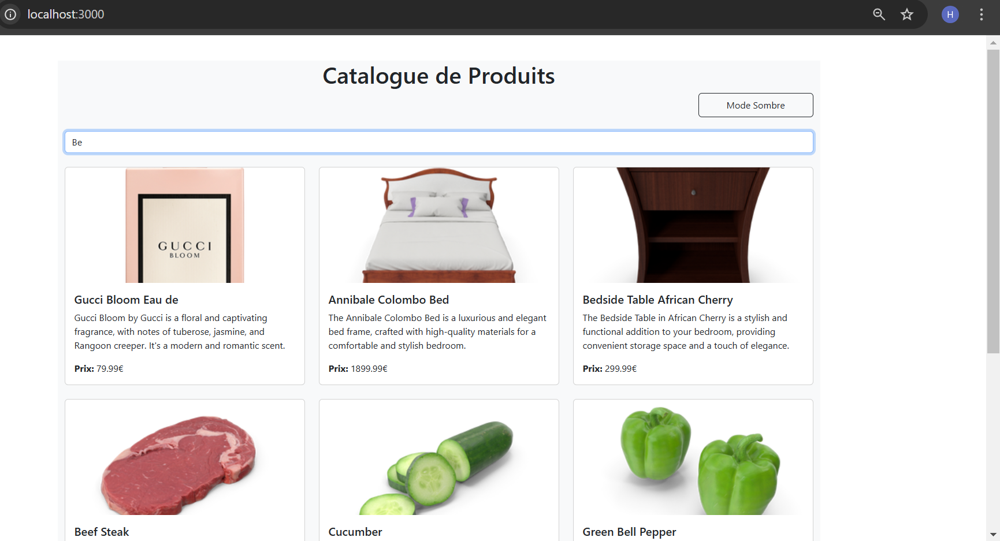

## Exercice 1 : État et Effets 
#### Objectif : Implémenter une recherche en temps réel

### 1.1 Modifier le composant ProductSearch pour utiliser la recherche

#### Problématique 
Le problème principal est d'envoyer la valeur searchTerm du composant ProductSearch vers le composant ProductList afin de filtrer les produits en fonction de ce terme.


#### Solution :
Pour transmettre la valeur searchTerm du composant ProductSearch à ProductList, j'ai déplacé le hook useState au niveau du composant parent (App). Ensuite, j'ai passé la fonction setSearchTerm en prop à ProductSearch. Ainsi, lorsque l'utilisateur saisit du texte dans l'input, App met à jour searchTerm, qui est ensuite transmis à ProductList pour filtrer les produits.

_Réponse pour l'exercice 1 :_

_App.js:_
```js

const App = () => {
  const [searchTerm, setSearchTerm] = useState("");
   //....
  return (
    //....
        <ProductSearch setSearchTerm={setSearchTerm} />
        <ProductList searchTerm={searchTerm} />
    //....
  );
};

```

_ProductList.js:_
```js
const ProductList = ({searchTerm}) => {  
  const { 
    products, 
    loading, 
    error,
  } = useProductSearch();
  
  if(searchTerm!=''){
    var filtredProducts=products.filter(
      (p)=>p.title.toUpperCase().includes(searchTerm.toUpperCase())
      || p.description.toUpperCase().includes(searchTerm.toUpperCase())
      || p.price.toString().toUpperCase().includes(searchTerm.toUpperCase())
    )
  }else{
    filtredProducts=products;
  }
  ....
  return (
    <div>
      <div className="row row-cols-1 row-cols-md-2 row-cols-lg-3 g-4">
        {filtredProducts.map(product => (
          <div key={product.id} className="col">
            <!--...-->
          </div>
        ))}
      </div>
    </div>
  );
};

```
_ProductSearch
.js:_
```js
const ProductSearch = ({setSearchTerm}) => {
  return (
    <div className="mb-4">
      <input
        type="text"
        onChange={(e) => setSearchTerm(e.target.value)}
        //...
      />
    </div>
  );
};

```


### 1.2 Implémenter le debounce sur la recherche

Pour implémenter le debounce, nous allons utiliser le hook useDebounce.


_Installation avec npm_
```bash 
npm install use-debounce
```

_Importer useDebounce_
```js
import { useDebounce  } from "use-debounce";
```

#### Utilisation de useDebounce
Nous allons utiliser un useState pour stocker la valeur de l’input et détecter ses changements. Ensuite, nous utilisons useDebounce pour retarder la mise à jour de la valeur, et un useEffect pour exécuter setSearchTerm une fois que le délai est écoulé.

```js
const ProductSearch = ({setSearchTerm}) => {
//...
  const [inputValue, setInputValue] = useState("");
  const [debouncedSearchTerm] = useDebounce(inputValue,1000);

  useEffect(() => {
    setSearchTerm(debouncedSearchTerm);
  }, [debouncedSearchTerm]);

  return (
    <div className="mb-4">
      <input
        type="text"
        input={inputValue}
        onChange={(e) => setInputValue(e.target.value)}
      />
    </div>
  );
};
```


#### Captures d'écran:

